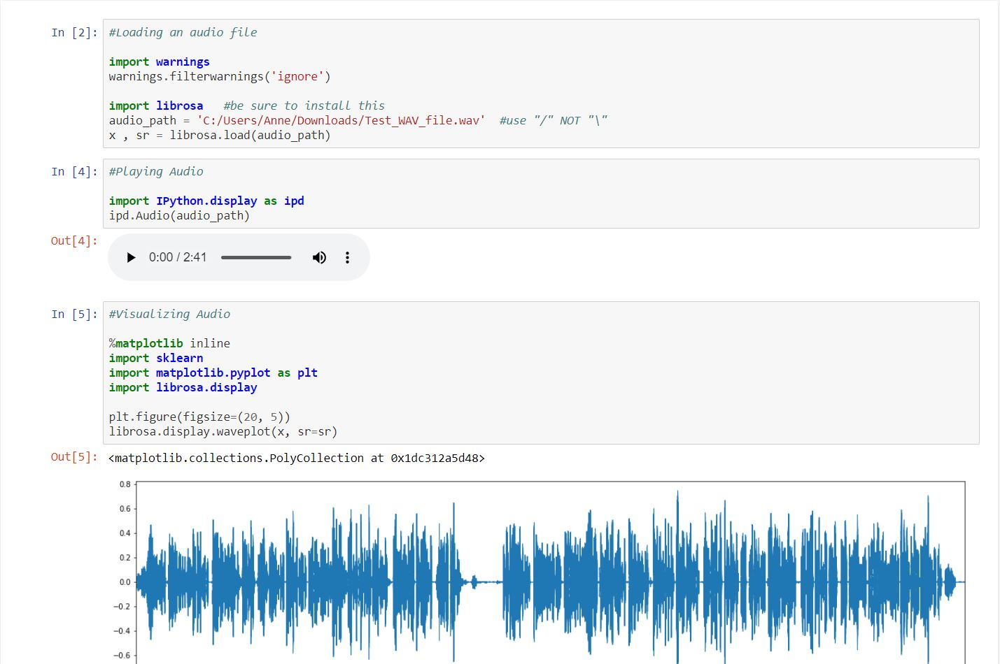

# Data Science
## Assignment 1.3 (initial output) *
Conduct image segmentation, representation, and feature extraction. Use or improve the attached file for the report.

## Assignment 3 (M1) Complete Image Pre-processing 
Upload the completed output of the activity here. Including the code.  

## Assignment 4 (M1)
Feature Extraction from Audio: 
1.  Download two (2) wav music files (even the chorus only) with different genre.  
2.  Using the sites shown below, extract audio features from the two music files.      
      https://www.kaggle.com/ashishpatel26/feature-extraction-from-audio 
      https://towardsdatascience.com/extract-features-of-music-75a3f9bc265d
3.  Save the extracted features, and the correspoding genre label in csv format.
4.  Submit the wav files, pdf file (see sample attached file below), and the csv dataset file.

Develop a mini dataset from any of the following:

If these files cannot be accomodated in this link, you may place them Google Drive and place the link here. Be sure to allow me to access the drive. 

## Assignment: Module 1 Summative Assessment 
1) emotion recognition thru voice
- you may get raw data (at least 5 files on each class of emotion) from https://www.kaggle.com/uldisvalainis/audio-emotions
- extract all necessary voice features on each file, such as MFCC, LPCC, Pitch, Intensity, etc. using Praat or similar tools.
- document how you conducted the process (specify the technique, tools, or algorithms you used if possible).
2) emotion recognition thru facial expressions
- you may get raw data (at least 5 files on each class of emotion) from https://www.kaggle.com/jonathanoheix/face-expression-recognition-dataset
- extract all necessary facial features on each file, needed to recognize emotion (e.g. facial Action Units, etc).
- document how you conducted the process (specify the technique, tools, or algorithms you used if possible).
3) object detection and classification
- you may get raw data (at least 5 files on 7 classes of fishes) from https://www.kaggle.com/crowww/a-large-scale-fish-dataset
- extract all necessary fish features on each file, needed to classify each fish.  
- document how you conducted the process (specify the technique, tools, or algorithms you used if possible).
4) or other machine learning applications (be sure to have good raw data).
NOTES:
- This is a group activity.
- Submit the raw data, the documentation of each process, and add the dataset with the corresponding label in a CSV file. 
